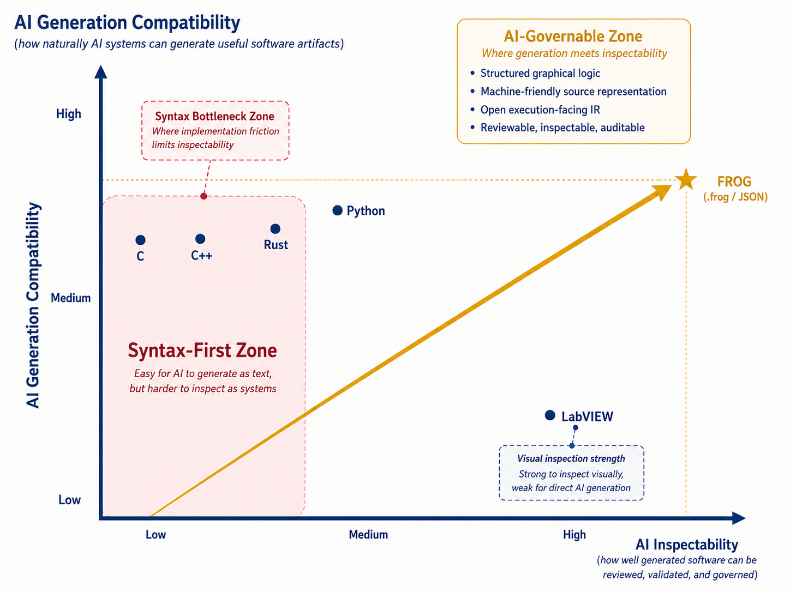

  

<h1 align="center">FROG AI Generation Compatibility vs AI Inspectability Orville Chart</h1>

  <strong>Repository entry point for the AI-era Orville positioning chart</strong> 
  FROG <code>(.frog / JSON)</code> targets the upper-right quadrant where AI-generatable source and AI-inspectable graphical system structure meet.

  

<h2>Why this page exists</h2>

This file exists as a root-level repository entry point so the AI-era Orville chart is visible from the main repository tree instead of being discoverable only through the <code>Strategy/</code> directory.

The detailed non-normative explanation is maintained in:

  <a href="./Strategy/AI-Generation-Inspectability-Orville.md"><strong>Strategy/AI-Generation-Inspectability-Orville.md</strong></a>

<h2>Strategic message</h2>

<blockquote>
  

  Textual languages are easy for AI systems to generate, but harder to inspect as structured systems.
  

</blockquote>

<blockquote>
  

  Historical graphical environments are easier to inspect visually, but weakly aligned with direct general-purpose AI generation.
  

</blockquote>

<blockquote>
  

  FROG <code>(.frog / JSON)</code> is designed to combine both: AI-generatable structured source and AI-inspectable graphical system structure.
  

</blockquote>

<h2>Boundary</h2>

This chart is strategic and non-normative. It does not define language semantics, source validity, conformance behavior, FIR construction, lowering, runtime behavior, or compiler behavior.

Its role is to make one AI-era positioning point visible: FROG is not only a graphical language proposal. It is also an attempt to make generated or human-authored logic structurally reviewable, governable, and connected to open execution-facing artifacts.

