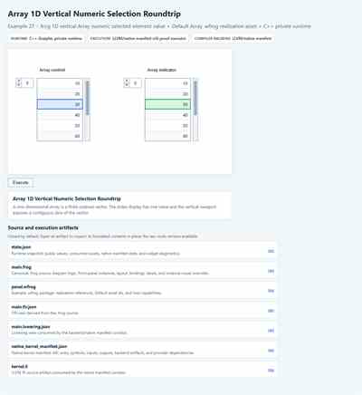

# Example 27 Reference Snapshot

This directory records the accepted public reference snapshot for Example 27,
`Array 1D Vertical Numeric Selection Roundtrip`.

1D vertical numeric Array control-to-indicator selected-element roundtrip using .frog-owned array data and Default Array .wfrog realization assets.

The snapshot is browser-host evidence for the public example dossier. It is not
runtime source truth, it does not publish Graiphic private runtime internals, and
it does not redefine the public FROG specification.

  

## Reference Snapshot Links

- [Accepted screenshot](./screenshot.svg)
- [Accepted state JSON](./state.accepted.json)
- [Visual contract](./visual-contract.md)
- [Machine-readable visual contract](./visual-contract.json)
- [Artifact hash index](./artifact-index.json)

## Files

- `screenshot.svg` - accepted browser-host visual state.
- `state.accepted.json` - accepted public runtime snapshot.
- `visual-contract.md` - human-readable appearance and interaction contract.
- `visual-contract.json` - machine-readable visual contract summary.
- `artifact-index.json` - relative artifact paths and hashes for traceability.

## Intermediate Development Note

This snapshot records a non-widget-composed Array development milestone. It is
retained for traceability because it validated 1D vertical Array rank, shape,
index, materialization, undefined-cell styling, selection posture, and native
value flow before the widget-composed Array container surface was introduced.

It is not the final runtime rendering target for Array. The final Array
rendering direction is the widget-composed container posture introduced by
Examples 29-30, where the Array repeats contained Default Numeric widget
realizations rather than drawing a simplified numeric grid.

## Boundary

The source of truth remains the .frog source, FIR/lowering artifacts, .wfrog
realization references, Default SVG realization assets, and native manifest
artifacts listed in `artifact-index.json`. The snapshot describes what was
accepted for this example; it is not a generalized runtime completeness claim.

