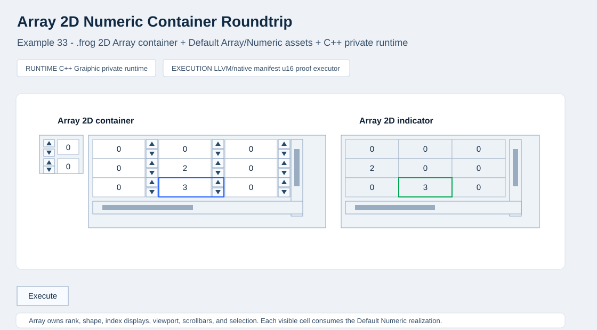

# Example 33 Reference Snapshot

This directory records the accepted public reference snapshot for Example 33,
Array 2D Numeric Container Roundtrip.

The example is a 2D Array container whose visible cells instantiate Default
Numeric widgets while the Array owns rank, shape, index displays, viewport,
scrolling, and repeated-cell layout.

The snapshot is browser-host evidence for the public example dossier. It is not
runtime source truth, it does not publish Graiphic private runtime internals, and
it does not redefine the public FROG specification.

  

## Reference Snapshot Links

- [Accepted screenshot](./screenshot.svg)
- [Accepted state JSON](./state.accepted.json)
- [Visual contract](./visual-contract.md)
- [Machine-readable visual contract](./visual-contract.json)
- [Artifact hash index](./artifact-index.json)

## Files

- `screenshot.svg` - accepted public visual reference for the browser-host checkpoint.
- `state.accepted.json` - accepted public runtime snapshot.
- `visual-contract.md` - human-readable appearance and interaction contract.
- `visual-contract.json` - machine-readable visual contract summary.
- `artifact-index.json` - relative artifact paths and hashes for traceability.

## Boundary

The source of truth remains the `.frog` source, FIR/lowering artifacts, `.wfrog`
realization references, Default SVG realization assets, and native manifest
artifacts listed in `artifact-index.json`. The snapshot describes what was
accepted for this example; it is not a generalized runtime completeness claim.

The Array is a container widget and each visible cell references the Default
Numeric realization through source-owned element template references. The
runtime consumes the declared FIR/lowering/native manifest path and must not
replace contained Numeric widgets with hardcoded grid cells.
