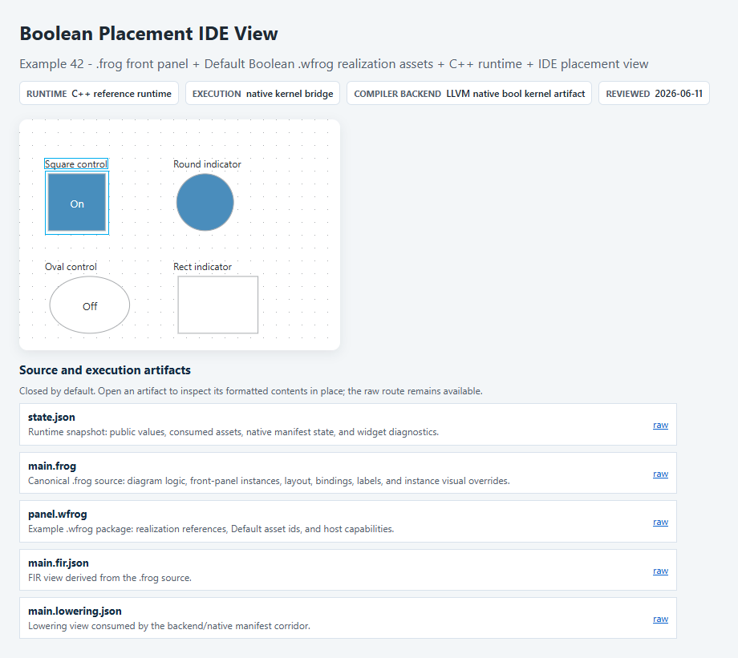

# Example 42 Reference Snapshot

This directory records the accepted public reference snapshot for Example 42, `Boolean Placement IDE View`.

The snapshot is browser-host evidence for the public example dossier. It is not runtime source truth, it does not publish Graiphic private runtime internals, and it does not redefine the public FROG specification.

  

## Reference Snapshot Links

- [Accepted screenshot](./screenshot.png)
- [Accepted state JSON](./state.accepted.json)
- [Visual contract](./visual-contract.md)
- [Machine-readable visual contract](./visual-contract.json)
- [Artifact hash index](./artifact-index.json)

## Files

- `screenshot.png` - accepted C++ browser-host visual state.
- `state.accepted.json` - accepted public runtime snapshot from `/state.json`.
- `visual-contract.md` - human-readable appearance and interaction contract.
- `visual-contract.json` - machine-readable visual contract summary.
- `artifact-index.json` - relative artifact paths and hashes for traceability.

## Boundary

The source of truth remains the .frog source, FIR/lowering artifacts, .wfrog realization references, Default SVG realization assets, and native or host manifest artifacts listed in `artifact-index.json`. The snapshot describes what was accepted for this example; it is not a generalized runtime completeness claim.
