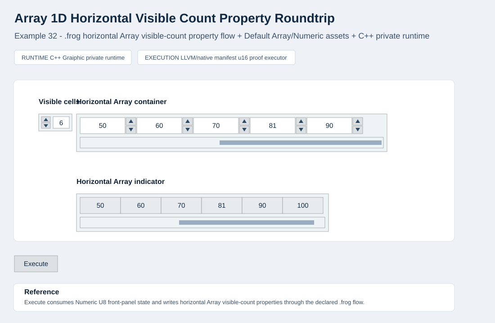

  

<h1 align="center">Array Widget Example Reference</h1>

  <strong>Current Array selection and widget-container proof surface</strong> 
  <em>FROG - Free Open Graphical Language</em>

<h2>Scope</h2>

The current Array progression is demonstrated by
<code>Examples/26_array_numeric_selection_roundtrip</code> through
<code>Examples/34_array_2d_visible_counts_property_roundtrip</code>.
Examples 26-28 are retained as intermediate non-widget-composed development
snapshots. Examples 29-34 show the current final rendering direction: an Array
container that repeats contained Default Numeric widget realizations instead of
drawing a simplified numeric grid.

The public class law remains <code>Libraries/Widgets/Array.md</code>, and the
Default realization surface remains
<code>Libraries/Realizations/Default/Array.md</code>. This page records the
practical example evidence and the boundaries that must stay true while the
Array examples evolve.

<pre><code>array.value
  -&gt; selected element / selected index posture
  -&gt; native u16 proof kernel
  -&gt; array indicator value
  -&gt; public selected element output

array element template
  -&gt; Default Numeric widget realization
  -&gt; repeated widget-backed cells inside the Array viewport</code></pre>

<h2>FROG-Owned Instance Data</h2>

The <code>.frog</code> source owns the diagram and all Array front-panel
instance data:

<ul>
  <li>Array rank: one-dimensional, two-dimensional, or three-dimensional.</li>
  <li>Shape, length, and regular materialized dimensions.</li>
  <li>Initial element values and source-owned default value for materialized numeric cells.</li>
  <li>Selected element id, selected indices, and optional selected value output.</li>
  <li>Viewport first indices, visible counts, orientation, and scrollbar posture.</li>
  <li>Index display visibility, values, position, and style.</li>
  <li>Element template binding, including <code>frog.widgets.numeric_control</code> or <code>frog.widgets.numeric_indicator</code> for the current numeric examples.</li>
  <li>Contained widget properties such as numeric representation, increment/decrement visibility, read-only posture, and default value.</li>
  <li>Labels, caption placement, layout, and instance-level visual overrides.</li>
</ul>

When numeric values are edited outside the current shape, the Array materializes
the regular collection shape needed to contain that value. New numeric cells are
initialized to <code>0</code>, matching the public Array class law.

<h2>Published Parts And Configurable Properties</h2>

<table>
  <thead>
    <tr>
      <th>Surface</th>
      <th>Current source properties</th>
      <th>Runtime obligation</th>
    </tr>
  </thead>
  <tbody>
    <tr>
      <td>Array frame</td>
      <td><code>style.frame.*</code>, <code>style.frame.padding</code></td>
      <td>Draw one uniform outer Array frame from source-owned style data.</td>
    </tr>
    <tr>
      <td>Index display</td>
      <td><code>index_display.*</code>, <code>style.index_display.*</code></td>
      <td>Render the index display as a neighboring Array subcontainer, not as part of the element viewport. The index display must keep a measured source-owned clearance from the Array viewport/frame so the two blocks never touch, overlap, or visually collapse. The current Default Array reference clearance from the index-display outer edge to the Array frame is 4 CSS px.</td>
    </tr>
    <tr>
      <td>Element region</td>
      <td><code>viewport.*</code>, <code>layout.cell_width</code>, <code>layout.cell_height</code></td>
      <td>Place visible cells from the Array viewport model and keep overlays aligned to the Default SVG parts. At maximum row or column offsets, the final visible row or column must remain fully visible. Any host clipping allowance such as <code>viewport.clip_bleed_trailing_x/y</code> is source-owned/default-realization data and must not move scrollbar geometry or logical visible counts.</td>
    </tr>
    <tr>
      <td>Visible-count property</td>
      <td><code>viewport.visible_counts[]</code>, property-write targets</td>
      <td>Apply visible viewport count changes only through declared diagram/property-write flow, not through runtime-local shortcuts.</td>
    </tr>
    <tr>
      <td>Contained Numeric widget</td>
      <td><code>element.class_id</code>, <code>element.template_ref</code>, <code>element.props.*</code></td>
      <td>Compose the Default Numeric widget inside each visible cell without replacing it with a runtime-local surrogate.</td>
    </tr>
    <tr>
      <td>Scrollbars</td>
      <td><code>scrollbars.*</code>, <code>viewport.*</code>, <code>style.scrollbar.*</code></td>
      <td>Keep scrollbar tracks, thumbs, visibility, colors, gaps, and orientation configurable.</td>
    </tr>
    <tr>
      <td>Selection</td>
      <td><code>viewport.selection_start[]</code>, <code>viewport.selection_size[]</code>, <code>style.selection.*</code></td>
      <td>Selection must not change layout dimensions or create extra per-cell shells.</td>
    </tr>
</tbody>
</table>

For 2D Array examples, <code>viewport.visible_counts[0]</code> is the visible
row count and <code>viewport.visible_counts[1]</code> is the visible column
count. Example 34 proves that these are diagram-addressable Array properties:
the Numeric U8 controls are ordinary front-panel controls, and their values
only alter the Array visible shape when <code>Execute</code> consumes explicit
property-write nodes from the <code>.frog</code> diagram.

Example 34 also validates that visible row and column counts may exceed the
currently materialized Array shape. The viewport may show additional default
numeric element positions without rejecting the value or clipping the final
visible row/column. Those limits belong to the source-owned Numeric U8 controls
and must not be silently derived from the current Array allocation.

Array geometry values consumed by a host as numbers, including
<code>index_display.layout.*</code>, viewport sizes, gaps, and padding, must be
authored as numeric values in source-owned data. A quoted numeric-looking value
is text, not a validated layout number.

The Default Array SVG publishes the Array shell and public composition parts.
The Default Numeric SVG publishes the value face, text value, increment up,
increment down, control body, and indicator body parts used by the contained
Numeric elements.

<h2>Widget-Backed Array Rule</h2>

The Array container may repeat another widget class as its element template.
For the current examples, the contained widget is Numeric. The contained widget
keeps its own realization, behavior, and property surface.

The Array may scroll, clip, repeat, materialize, and position contained
widgets. It must not redraw them as a simplified HTML table, and it must not
insert fake separator lines around cells when neighboring contained widgets are
already sharing their published bounds.

When <code>element.layout.padding</code> and <code>element_gap.size</code> are
zero, repeated contained widgets may touch or visually superpose adjacent
borders. This is the expected LabVIEW-like posture for the current Numeric
Array container examples.

<h2>WFROG-Owned Realization Data</h2>

The Array examples use package files such as:

<pre><code>Examples/26_array_numeric_selection_roundtrip/ui/array_panel.wfrog
Examples/27_array_1d_vertical_numeric_selection_roundtrip/ui/array_panel.wfrog
Examples/28_array_3d_numeric_selection_roundtrip/ui/array_panel.wfrog
Examples/29_array_1d_numeric_container_roundtrip/ui/array_panel.wfrog
Examples/30_array_1d_horizontal_numeric_container_roundtrip/ui/array_panel.wfrog
Examples/31_array_1d_visible_count_property_roundtrip/ui/array_panel.wfrog
Examples/32_array_1d_horizontal_visible_count_property_roundtrip/ui/array_panel.wfrog
Examples/33_array_2d_numeric_container_roundtrip/ui/array_panel.wfrog
Examples/34_array_2d_visible_counts_property_roundtrip/ui/array_panel.wfrog</code></pre>

The <code>.wfrog</code> package resolves Default realization assets and host
capability declarations. It does not own Array values, shape, layout, selected
indices, or diagram behavior.

<ul>
  <li>Default Array package: <code>Libraries/Realizations/Default/array.default.wfrog</code></li>
  <li>Default Array shell: <code>Libraries/Realizations/Default/assets/array/templates/array_shell.svg</code></li>
  <li>Default Numeric package for widget-backed cells: <code>Libraries/Realizations/Default/numeric.default.wfrog</code></li>
  <li>Default Numeric SVG: <code>Libraries/Realizations/Default/assets/numeric/templates/numeric_rectangular.svg</code></li>
</ul>

<h2>Runtime Expectations</h2>

<ul>
  <li>The runtime consumes <code>.frog</code> Array instance data, <code>.wfrog</code> realization references, Default SVG assets, FIR/lowering artifacts, and the native manifest where the example is native-backed.</li>
  <li>The runtime may provide host overlays for element editing, index displays, and scrollbars, but those overlays must align to published parts and source-owned geometry.</li>
  <li>Editing a front-panel element changes command-side front-panel state. It does not execute the diagram until the example's explicit <code>Execute</code> action.</li>
  <li>Control Arrays may edit values and materialize new numeric cells when resizing is legal.</li>
  <li>Indicator Arrays remain read-only for value edits but may allow viewport inspection.</li>
  <li>No accepted Array example may rely on an HTML/CSS fallback widget or a duplicated example-local SVG skin.</li>
</ul>

<h2>Native Kernel Posture</h2>

The current Array examples are post-public-runtime-boundary widget progression
examples. They contain public source, FIR, lowering, Default realization
references, and native manifest proof material. Runtime implementation for
these slices continues in <code>Graiphic/FROG-Runtime</code> unless explicitly
promoted later.

<ul>
  <li>Example 26: intermediate 2D numeric selected-element proof; not the final widget-composed Array rendering target.</li>
  <li>Example 27: intermediate 1D vertical numeric selected-element proof; not the final widget-composed Array rendering target.</li>
  <li>Example 28: intermediate 3D numeric selected-element proof; not the final widget-composed Array rendering target.</li>
  <li>Example 29: current 1D vertical Array container posture with repeated Default Numeric element widgets.</li>
  <li>Example 30: current 1D horizontal Array container posture with repeated Default Numeric element widgets.</li>
  <li>Example 31: current 1D vertical Array container property-write posture where a Numeric U8 control drives <code>viewport.visible_counts[0]</code> on <code>Execute</code>.</li>
  <li>Example 32: current 1D horizontal Array container property-write posture where a Numeric U8 control drives <code>viewport.visible_counts[1]</code> on <code>Execute</code>.</li>
  <li>Example 33: current 2D Array container posture with repeated Default Numeric element widgets.</li>
  <li>Example 34: current 2D Array container property-write posture where two Numeric U8 controls drive <code>viewport.visible_counts[0]</code> and <code>viewport.visible_counts[1]</code> on <code>Execute</code>.</li>
</ul>

Example 34 keeps the LabVIEW-like flow explicit:

<pre><code>visible_row_count.value
  -&gt; property_write numeric_array.viewport.visible_counts[0]
  -&gt; property_write published_array.viewport.visible_counts[0]

visible_column_count.value
  -&gt; property_write numeric_array.viewport.visible_counts[1]
  -&gt; property_write published_array.viewport.visible_counts[1]

numeric_array.selected_element_value
  -&gt; native u16 proof manifest
  -&gt; published_array.selected_element_value
  -&gt; public selected element output</code></pre>

The visible-shape controls therefore do not mutate the Array through a
runtime-local shortcut. They are part of the <code>.frog</code> diagram, are
preserved in FIR, are declared in lowering, and are consumed by the runtime
alongside the native manifest and Default Array/Numeric realization assets.

Examples 26-28 helped validate Array rank, shape, indexing, materialization,
viewport, selection, and native value flow before the Array container began
composing real widget instances. They are not the final runtime rendering
target for Array. The final direction is the widget-composed Array container
posture demonstrated by Examples 29-34.

<h2>Reference Snapshots</h2>

The accepted Array reference snapshots below show the current public visual dossier for the Array family.
They are browser-host evidence for the examples and do not expose Graiphic private runtime source internals.

Snapshots for Examples 26-28 are historical/intermediate evidence. They remain
useful for regression context, but should not be used as the final visual model
for Array rendering.

<section>
  <h3>Example 26: Array 2D numeric selection</h3>
  
<strong>Intermediate note:</strong> This snapshot records a non-widget-composed Array development milestone. It is preserved for traceability and regression context, but the final Array rendering direction is the widget-composed container posture introduced in Examples 29-30.

  
<a href="../26_array_numeric_selection_roundtrip/reference/README.md">Reference snapshot README</a>

  

    
  

  <ul>
    <li><a href="../26_array_numeric_selection_roundtrip/reference/screenshot.jpg">Accepted screenshot</a></li>
    <li><a href="../26_array_numeric_selection_roundtrip/reference/state.accepted.json">Accepted state JSON</a></li>
    <li><a href="../26_array_numeric_selection_roundtrip/reference/visual-contract.md">Visual contract</a></li>
    <li><a href="../26_array_numeric_selection_roundtrip/reference/visual-contract.json">Machine-readable visual contract</a></li>
    <li><a href="../26_array_numeric_selection_roundtrip/reference/artifact-index.json">Artifact hash index</a></li>
  </ul>
</section>

<section>
  <h3>Example 27: Array 1D vertical numeric selection</h3>
  
<strong>Intermediate note:</strong> This snapshot records a non-widget-composed Array development milestone. It is preserved for traceability and regression context, but the final Array rendering direction is the widget-composed container posture introduced in Examples 29-30.

  
<a href="../27_array_1d_vertical_numeric_selection_roundtrip/reference/README.md">Reference snapshot README</a>

  

    
  

  <ul>
    <li><a href="../27_array_1d_vertical_numeric_selection_roundtrip/reference/screenshot.jpg">Accepted screenshot</a></li>
    <li><a href="../27_array_1d_vertical_numeric_selection_roundtrip/reference/state.accepted.json">Accepted state JSON</a></li>
    <li><a href="../27_array_1d_vertical_numeric_selection_roundtrip/reference/visual-contract.md">Visual contract</a></li>
    <li><a href="../27_array_1d_vertical_numeric_selection_roundtrip/reference/visual-contract.json">Machine-readable visual contract</a></li>
    <li><a href="../27_array_1d_vertical_numeric_selection_roundtrip/reference/artifact-index.json">Artifact hash index</a></li>
  </ul>
</section>

<section>
  <h3>Example 28: Array 3D numeric selection</h3>
  
<strong>Intermediate note:</strong> This snapshot records a non-widget-composed Array development milestone. It is preserved for traceability and regression context, but the final Array rendering direction is the widget-composed container posture introduced in Examples 29-30.

  
<a href="../28_array_3d_numeric_selection_roundtrip/reference/README.md">Reference snapshot README</a>

  

    
  

  <ul>
    <li><a href="../28_array_3d_numeric_selection_roundtrip/reference/screenshot.jpg">Accepted screenshot</a></li>
    <li><a href="../28_array_3d_numeric_selection_roundtrip/reference/state.accepted.json">Accepted state JSON</a></li>
    <li><a href="../28_array_3d_numeric_selection_roundtrip/reference/visual-contract.md">Visual contract</a></li>
    <li><a href="../28_array_3d_numeric_selection_roundtrip/reference/visual-contract.json">Machine-readable visual contract</a></li>
    <li><a href="../28_array_3d_numeric_selection_roundtrip/reference/artifact-index.json">Artifact hash index</a></li>
  </ul>
</section>

<section>
  <h3>Example 29: Array 1D vertical Numeric container</h3>
  
<a href="../29_array_1d_numeric_container_roundtrip/reference/README.md">Reference snapshot README</a>

  

    
  

  <ul>
    <li><a href="../29_array_1d_numeric_container_roundtrip/reference/screenshot.jpg">Accepted screenshot</a></li>
    <li><a href="../29_array_1d_numeric_container_roundtrip/reference/state.accepted.json">Accepted state JSON</a></li>
    <li><a href="../29_array_1d_numeric_container_roundtrip/reference/visual-contract.md">Visual contract</a></li>
    <li><a href="../29_array_1d_numeric_container_roundtrip/reference/visual-contract.json">Machine-readable visual contract</a></li>
    <li><a href="../29_array_1d_numeric_container_roundtrip/reference/artifact-index.json">Artifact hash index</a></li>
  </ul>
</section>

<section>
  <h3>Example 30: Array 1D horizontal Numeric container</h3>
  
<a href="../30_array_1d_horizontal_numeric_container_roundtrip/reference/README.md">Reference snapshot README</a>

  

    
  

  <ul>
    <li><a href="../30_array_1d_horizontal_numeric_container_roundtrip/reference/screenshot.jpg">Accepted screenshot</a></li>
    <li><a href="../30_array_1d_horizontal_numeric_container_roundtrip/reference/state.accepted.json">Accepted state JSON</a></li>
    <li><a href="../30_array_1d_horizontal_numeric_container_roundtrip/reference/visual-contract.md">Visual contract</a></li>
    <li><a href="../30_array_1d_horizontal_numeric_container_roundtrip/reference/visual-contract.json">Machine-readable visual contract</a></li>
    <li><a href="../30_array_1d_horizontal_numeric_container_roundtrip/reference/artifact-index.json">Artifact hash index</a></li>
  </ul>
</section>

<section>
  <h3>Example 31: Array 1D visible-count property write</h3>
  
<a href="../31_array_1d_visible_count_property_roundtrip/reference/README.md">Reference snapshot README</a>

  

    
  

  <ul>
    <li><a href="../31_array_1d_visible_count_property_roundtrip/reference/screenshot.jpg">Accepted screenshot</a></li>
    <li><a href="../31_array_1d_visible_count_property_roundtrip/reference/state.accepted.json">Accepted state JSON</a></li>
    <li><a href="../31_array_1d_visible_count_property_roundtrip/reference/visual-contract.md">Visual contract</a></li>
    <li><a href="../31_array_1d_visible_count_property_roundtrip/reference/visual-contract.json">Machine-readable visual contract</a></li>
    <li><a href="../31_array_1d_visible_count_property_roundtrip/reference/artifact-index.json">Artifact hash index</a></li>
  </ul>
</section>

<section>
  <h3>Example 32: Array 1D horizontal visible-count property write</h3>
  
<a href="../32_array_1d_horizontal_visible_count_property_roundtrip/reference/README.md">Reference snapshot README</a>

  

    
  

  <ul>
    <li><a href="../32_array_1d_horizontal_visible_count_property_roundtrip/reference/screenshot.svg">Accepted screenshot</a></li>
    <li><a href="../32_array_1d_horizontal_visible_count_property_roundtrip/reference/state.accepted.json">Accepted state JSON</a></li>
    <li><a href="../32_array_1d_horizontal_visible_count_property_roundtrip/reference/visual-contract.md">Visual contract</a></li>
    <li><a href="../32_array_1d_horizontal_visible_count_property_roundtrip/reference/visual-contract.json">Machine-readable visual contract</a></li>
    <li><a href="../32_array_1d_horizontal_visible_count_property_roundtrip/reference/artifact-index.json">Artifact hash index</a></li>
  </ul>
</section>

<section>
  <h3>Example 33: Array 2D Numeric container</h3>
  
<a href="../33_array_2d_numeric_container_roundtrip/reference/README.md">Reference snapshot README</a>

  

    
  

  <ul>
    <li><a href="../33_array_2d_numeric_container_roundtrip/reference/screenshot.svg">Accepted screenshot</a></li>
    <li><a href="../33_array_2d_numeric_container_roundtrip/reference/state.accepted.json">Accepted state JSON</a></li>
    <li><a href="../33_array_2d_numeric_container_roundtrip/reference/visual-contract.md">Visual contract</a></li>
    <li><a href="../33_array_2d_numeric_container_roundtrip/reference/visual-contract.json">Machine-readable visual contract</a></li>
    <li><a href="../33_array_2d_numeric_container_roundtrip/reference/artifact-index.json">Artifact hash index</a></li>
  </ul>
</section>

<section>
  <h3>Example 34: Array 2D visible-count property write</h3>
  
<a href="../34_array_2d_visible_counts_property_roundtrip/reference/README.md">Reference snapshot README</a>

  

    
  

  <ul>
    <li><a href="../34_array_2d_visible_counts_property_roundtrip/reference/screenshot.svg">Accepted screenshot</a></li>
    <li><a href="../34_array_2d_visible_counts_property_roundtrip/reference/state.accepted.json">Accepted state JSON</a></li>
    <li><a href="../34_array_2d_visible_counts_property_roundtrip/reference/visual-contract.md">Visual contract</a></li>
    <li><a href="../34_array_2d_visible_counts_property_roundtrip/reference/visual-contract.json">Machine-readable visual contract</a></li>
    <li><a href="../34_array_2d_visible_counts_property_roundtrip/reference/artifact-index.json">Artifact hash index</a></li>
  </ul>
</section>

<h2>Validation Notes</h2>

<ul>
  <li>Index displays and Array element containers must remain visually distinct subcontainers.</li>
  <li>Array outer frame thickness must remain uniform after resize.</li>
  <li>Repeated contained widgets must preserve the contained widget's own validated default realization.</li>
  <li>Maximum row and column offsets must be visually inspected: the terminal row or column must remain fully visible, with scrollbars aligned to the logical viewport rather than any clipping bleed.</li>
  <li>Array selection must not resize cells or alter the contained widget border geometry.</li>
  <li>Scrollbar tracks and thumbs must stay configurable and aligned to the Array viewport.</li>
  <li>Control and indicator surfaces may differ in interactivity, but their geometry law must remain comparable.</li>
  <li>Property writes such as <code>viewport.visible_counts[]</code> must remain explicit diagram flow consumed on <code>Execute</code> unless a later IDE/design-time host task deliberately validates live editing behavior.</li>
  <li>Browser-host screenshots are accepted evidence for the current host, not the only possible FROG host.</li>
</ul>
